# Python基础教程

## 数据类型

* python输出00，01，02或001，002，003等格式字符串

```python
for i in range(1,30):
    print (str(i).rjust(2,'0'))
```

`rjust()` 方法会返回一个原字符串右对齐,并使用空格填充至长度 width 的新字符串。如果指定的长度小于字符串的长度则返回原字符串

**int格式的不支持使用rjust方法，可以先用str函数转化为string字符串**

## Python序列

**参考书《Python基础教程》**

Python内置了多种序列，其中最常用的两种：**列表和元组**，另一种重要的序列是**字符串**

列表和元组的主要不同在于，==列表是可以修改的，而元组不可以==。这意味着列表适用于需要中途添加元素的情形，而元组适用于出于某种考虑需要禁止修改序列的情形。

### 通用序列操作

* 索引

序列中的所有元素都有编号——从0开始递增

可使用索引来获取元素。这种索引方式适用于所有序列。当你==使用负数索引时，Python将从右（即从最后一个元素）开始往左数，因此-1是最后一个元素的位置==。

对于字符串字面量（以及其他的序列字面量），可直接对其执行索引操作，无需先将其赋给变量。这与先赋给变量再对变量执行索引操作的效果是一样的。

* 切片

切片适用于提取序列的一部分，其中的编号非常重要：==第一个索引是包含的第一个元素的编号，但第二个索引是切片后余下的第一个元素的编号==

```python
numbers = [1, 2, 3, 4, 5, 6, 7, 8, 9, 10] 
>>> numbers[3:6] [4, 5, 6] 
>>> numbers[0:1] [1]
```

* 序列相加
* 乘法
* 成员资格

要检查特定的值是否包含在序列中，可使用运算符`in`

### 列表

列表是最常用的Python数据类型，它可以作为一个方括号内的逗号分隔值出现。列表的数据项不需要具有相同的类型

| Python表达式                 | 结果描述                     |                      |
| ---------------------------- | ---------------------------- | -------------------- |
| len([1, 2, 3])               | 3                            | 长度                 |
| [1, 2, 3] + [4, 5, 6]        | [1, 2, 3, 4, 5, 6]           | 组合                 |
| ['Hi!'] * 4                  | ['Hi!', 'Hi!', 'Hi!', 'Hi!'] | 重复                 |
| 3 in [1, 2, 3]               | True                         | 元素是否存在于列表中 |
| for x in [1, 2, 3]: print x, | 1 2 3                        | 迭代                 |

### 元组


## Python语句

### 条件语句

Python程序语言指定任何非0和非空（null）值为true，0 或者 null为false。

Python 编程中 if 语句用于控制程序的执行，基本形式为：

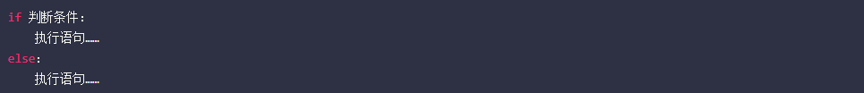

==注意冒号==

由于 python 并不支持 switch 语句，所以多个条件判断，只能用 `elif` 来实现，如果判断需要多个条件需同时判断时，可以使用 or （或），表示两个条件有一个成立时判断条件成功；使用 and （与）时，表示只有两个条件同时成立的情况下，判断条件才成功。

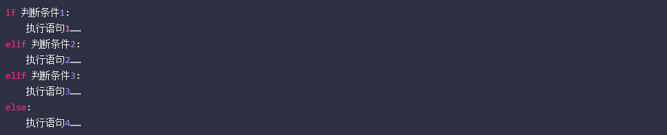

### 循环语句

Python提供了for循环和while循环（在Python中没有do..while循环）:

* while 循环


无限循环可以使用 CTRL+C 来中断循环

* for 循环

Python for循环可以遍历任何序列的项目，如一个列表或者一个字符串

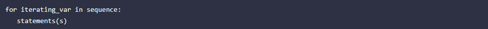

* else语句

在 python 中，for … else 表示这样的意思，for 中的语句和普通的没有区别，else 中的语句会在循环正常执行完（即 for 不是通过 break 跳出而中断的）的情况下执行，while … else 也是一样

```python
for num in range(10,20):  # 迭代 10 到 20 之间的数字
   for i in range(2,num): # 根据因子迭代
      if num%i == 0:      # 确定第一个因子
         j=num/i          # 计算第二个因子
         print '%d 等于 %d * %d' % (num,i,j)
         break            # 跳出当前循环
   else:                  # 循环的 else 部分
      print num, '是一个质数'
```

循环控制语句可以更改语句执行的顺序。Python支持以下循环控制语句：

| 控制语句       | 描述                                                         |
| -------------- | ------------------------------------------------------------ |
| `break`语句    | 在语句块执行过程中终止循环，并且跳出整个循环                 |
| `continue`语句 | 在语句块执行过程中终止当前循环，跳出该次循环，执行下一次循环。 |
| `pass`语句     | pass是空语句，是为了保持程序结构的完整性。                   |

## Python函数

------

**`if __name__ == '__main__'` 如何正确理解?**

1. 这段代码的功能

  一个python的文件有两种使用的方法，第一是直接作为脚本执行，第二是import到其他的python脚本中被调用（模块重用）执行。因此`if __name__ == 'main': `的作用就是控制这两种情况执行代码的过程，在`if __name__ == 'main': `下的代码只有在第一种情况下（即文件作为脚本直接执行）才会被执行，而import到其他脚本中是不会被执行的。

 举个例子，下面在test.py中写入如下代码：

```python
print "I'm the first."
if __name__=="__main__":
  print "I'm the second."
```

并直接执行test.py，结果如下图，可以成功print两行字符串。即，`if __name__=="__main__": `语句之前和之后的代码都被执行。

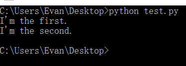

然后在同一文件夹新建名称为import_test.py的脚本，只输入如代码：

```python
import test
```

执行import_test.py脚本，输出结果如下：

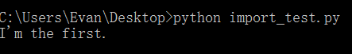

只输出了第一行字符串。即，`if __name__=="__main__":` 之前的语句被执行，之后的没有被执行。

2. 运行的原理

 每个python模块（python文件，也就是此处的test.py和import_test.py）都包含内置的变量`__name__`,当运行模块被执行的时候，`__name__`等于文件名（包含了后缀.py）；如果import到其他模块中，则`__name__`等于模块名称（不包含后缀.py）。而`__main__`等于当前执行文件的名称（包含了后缀.py），进而当模块被直接执行时，`__name__ == 'main'`结果为真。

 同样举例说明，我们在test.py脚本的`if __name__=="__main__":`之前加入`print  __name__`，即将`__name__`打印出来。文件内容和结果如下：

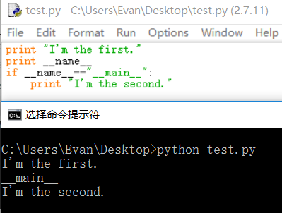

可以看出，此时变量`__name__`的值为`"__main__"`；再执行import_test.py，模块内容和执行结果如下：

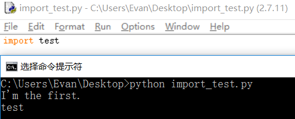

此时，test.py中的`__name__`变量值为test，不满足`__name__=="__main__"`的条件，因此，无法执行其后的代码。

------


## Python文件操作

Python遍历文件夹

```python
import os
# 遍历文件夹
def walkFile(file):
	for root, dirs, files in os.walk(file):
         # root 表示当前正在访问的文件夹路径
         # dirs 表示该文件夹下的子目录名list
         # files 表示该文件夹下的文件list
         # 遍历文件
		for f in files:
 			 print(os.path.join(root, f))
 			# 遍历所有的文件夹
 		for d in dirs:
 			 print(os.path.join(root, d))
def main():
	walkFile("f:/ostest/")
if __name__ == '__main__':
 	main()
```


# Python网络编程

更深入地了解Python网络编程，推荐你阅读John Goerzen的著作《Python网络编程基础》，其中非常详尽地讨论了这个主题。

==TCP/IP 是 http 协议的基础，而 socket 就是 TCP/IP的实现手段。==

网络编程中的一个基本组件是**套接字（socket）**。套接字基本上是一个信息通道，两端各有一个程序。这些程序可能位于（通过网络相连的）不同的计算机上，通过套接字向对方发送信息。

## 为什么socket翻译为套接字？ 

socket英文本义为孔和插座的意思

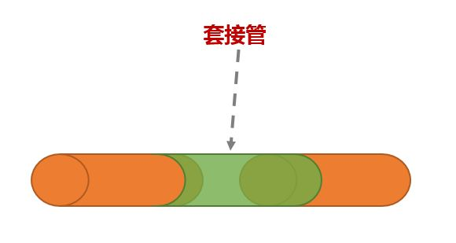

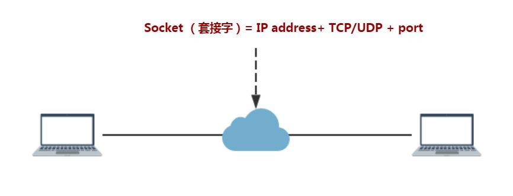

套接字分为两类：**服务器套接字和客户端套接字**。

* 创建服务器套接字后，让它等待连接请求的到来。这样，它将在某个网络地址（由IP地址和端口号组成）处监听，直到客户端套接字建立连接。随后，客户端和服务器就能通信了。 
* 客户端套接字处理起来通常比服务器端套接字容易些，因为服务器必须准备随时处理客户端连接，还必须处理多个连接；而客户端只需连接，完成任务后再断开连接即可。

套接字是模块socket中socket类的实例。实例化套接字时最多可指定三个参数：一个地址族（默认为`socket.AF_INET`）；是流套接字（`socket.SOCK_STREAM`，默认设置）还是数据报套接字（`socket.SOCK_DGRAM`）；协议（使用默认值0就好）。创建普通套接字时，不用提供任何参数。

## 网络模块

服务器初始化socket，调用方法bind与端口绑定，再调用方法listen来监听特定的地址，调用accept阻塞，等待客户端连接。这个方法将阻断（等待）到客户端连接到来为止，然后返回一个格式为(client, address)的元组，其中client是一个客户端套接字，而address是前面解释过的地址。服务器能以其认为合适的方式处理客户端连接，然后再次调用accept以接着等待新连接到来。这通常是在一个无限循环中完成的。 客户端初始化socket，调用方法connect并提供调用方法bind时指定的地址连接服务器（在服务器端，可使用函数socket.gethostname获取当前机器的主机名）。这里的地址是一个格式为(host, port)的元组，其中host是主机名（如www.example.com），而port是端口号（一个整数）。

 为传输数据，套接字提供了两个方法：send和recv（表示receive）。要发送数据，可调用方法send并提供一个字符串；要接收数据，可调用recv并指定最多接收多少个字节的数据。如果不确定该指定什么数字，1024是个不错的选择。


最简单的服务器

```python
import socket 
s = socket.socket() 
host = socket.gethostname() 
port = 1234 
s.bind((host, port))
s.listen(5)
while True: 
    c, addr = s.accept() 
    print('Got connection from', addr) 
    c.send('Thank you for connecting')
    c.close()
```

最简单的客户端

```python
import socket 
s = socket.socket() 
host = socket.gethostname() 
port = 1234 
s.connect((host, port))
print(s.recv(1024)) 
```


==真正的双向非拥塞通信应该由多线程的方式实现==

Socket Programming HOWTO http://docs.python.org/dev/howto/sockets.html

https://docs.python.org/zh-cn/3/library/socket.html


## UDP协议 

UDP 的英文单词是**User Datagram Protocol**，缩写为UDP，是一种==用户数据报协议，又称为用户数据报文协议，是一种报文的协议，是一个简单的面向数据报的传输层协议==。UDP的发起和接受是不需要经过连接的，仅仅只需要发送在对应端口上进行监听接受即可，不需要两个客户端一定是连接的。

这里大家要区别的是：另一种常用的通信协议是TCP协议，两者的区别是TCP是面向连接的、传输可靠的，UDP是面向数据报的、不可靠的。它一旦把数据发送出去，就不保留备份数据，发出去的数据有没有被收到也不进行校验，容易丢包。
虽然用UDP传输数据不可靠，但它的优点是和TCP比，速度快，对于不要求可靠到达的数据，就可以使用UDP协议。

首先想实现发消息要满足一下几点：

1. 怎么发？

2. 和谁发？

3. 想发什么消息？

第一个怎么发，就是要确定用到什么协议，是用tcp协议还是udp协议。

第二个和谁发，就是要确认对方ip和port，不然系统怎么知道把消息发到那里去。

第三个发什么消息，就不用说什么了吧。


1. 首先解决怎么发的问题，那不用说，先创建套接字和确定使用的协议。

```python
from socket import *
s = socket(AF_INET, SOCK_DGRAM)  # 创建套接字，现在用的是udp，还有一种tcp
```

2. 工具确定了，再确定发送对象

```python
sendaddr = ("172.20.10.3", 8080)  # 确定发送ip地址和端口
```

3. 再确定发送内容，一个简单的发消息功能就实现了。

```python
senddata = input("请输入要发送的内容：")  # 确定要发送的信息
									 #python3 把raw_input()改成了input()
```

完整代码：

```python
from socket import *
def udpsend_():
    s = socket(AF_INET, SOCK_DGRAM)  # 创建套接字,现在用的是udp，还有一种tcp
    sendaddr = ("172.20.10.3", 8080)  # 确定发送ip地址和端口
    while True:   #我们不想发送一次就结束了，希望可以一直发。
        try:    #检查错误的，可以去掉。
            senddata = input("请输入要发送的内容：")  # 确定要发送的信息
            s.sendto(senddata.encode("gb2312"), sendaddr)  # 发送信息,这里用Gb2312编码是因为网络调试助手是用GB2312编码的。通常用utf-8编码。
        except Exception as e:
            print(e)
if __name__ == '__main__':
    udpsend_()
    
```

实现接收消息

要想收到消息，就需要确保端口是稳定的，不能随机，不然怎么能发送到呢。这么说可能没什么概念，其实上面我们收到的两条消息，端口是随机的，并不是同一个。**发消息只需要确定目的地的ip和端口就可以了，不需要关心自己的端口，但是收消息就要确定自己的ip和端口了。**

1. 所以收消息最重要的一点就是先绑定自己的ip和port。当然了，绑定之前还是要先创建套接字。

```python
from socket import *
s = socket(AF_INET, SOCK_DGRAM)  # 创建套接字，这次用来收消息
```

2. 绑定ip和port，就可以收消息了

```python
s.bind(('', 8080))  # 绑定端口，bind绑定的是一个元组。（ip，port）
```

```python
from socket import *
def udprecv():
    s = socket(AF_INET, SOCK_DGRAM)  # 创建套接字，这次用来收消息
    s.bind(('', 8088))  # 绑定端口，bind绑定的是一个元组。（ip，port）
    while True:
        try:
            recvdata = s.recvfrom(1024)  # 收消息，每次最多收1024个字节
            content,destinfo = recvdata    #收到的数据是一个元组，将其分离出来，单独对内容解码
            print(content.decode("gb2312"))
            print(destinfo)   #源ip地址，可以不用打印
        except Exception as e:
            print(e)
if __name__ == '__main__':
    udprecv()
```

# 爬虫

互联网是由一个个站点和网络设备组成的大网，我们通过浏览器访问站点，站点把HTML、JS、CSS代码返回给浏览器，这些代码经过浏览器解析、渲染，将丰富多彩的网页呈现我们眼前。

## 爬虫是什么

如果我们把互联网比作一张大的蜘蛛网，数据便是存放于蜘蛛网的各个节点，而爬虫就是一只小蜘蛛，沿着网络抓取自己的猎物（数据）爬虫指的是：向网站发起请求，获取资源后分析并提取有用数据的程序。

从技术层面来说就是 通过程序模拟浏览器请求站点的行为，把站点返回的HTML代码/JSON数据/二进制数据（图片、视频） 爬到本地，进而提取自己需要的数据，存放起来使用


# Python图像处理

## OpenCV

OpenCV是一个旨在解决计算机视觉问题的Python库。OpenCV最初由Intel在1999年开发，但是后来由Willow Garage资助。它支持很多编程语言，如C++，Python，Java等等。它也支持多种平台，包括Windows，Linux和MacOS。

OpenCV Python只是一个与Python一起使用的原始C++库的包装类。通过使用它，所有OpenCV数组结构都能被转化为NumPy数组或从NumPy数组转化而来。这样就可以轻松地将其与其他使用NumPy的库集成。例如，SciPy和Matplotlib等库。

https://opencv.org/

### 安装OpenCV

```shell
pip install opencv-python
```

### 读取显示图片

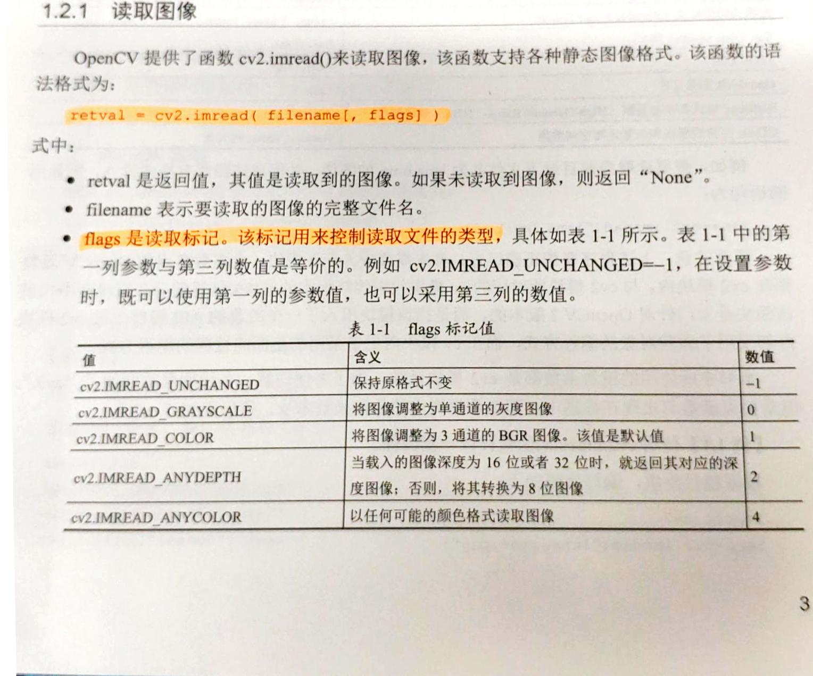

```python
from cv2 import cv2 
img=cv2.imread('tankCar.jpg',cv2.IMREAD_COLOR)
cv2.imshow('image',img)
k=cv2.waitKey(0)
#当键盘输入“s”时保存图片到指定文件内
#当键盘输入“esc”时推出
if k==27:
    cv2.destroyAllWindows()
elif k==ord('s'):
    cv2.imwrite('car.jpg',img)
    print('save image successfully')
    cv2.destroyAllWindows()
```


### 图片属性

图像的属性包括行、列、通道、图像数据类型、像素数目等

`img.shape`可以获取图像的形状。返回值是一个包含行数、列数、通道数的元组

**如果图像是灰度图，返回值仅有行数和列数。所以通过检查这个返回值就可以知道加载的是灰度图还是彩色图。**

`img.size`可以返回图像的像素数目

```python
import cv2
import numpy as np 
img=cv2.imread('1.jpg')
print img.size

[Out]: 3780000
```


## 图像运算

## 色彩空间转换

HSV(色彩/色度Hue，饱和度Saturation，亮度 Value)是根据颜色的直观特性创建的一种颜色空间， 也称六角锥体模型。

 ==之所以选择 HSV，是因为 H 代表的色调基本上可以确定某种颜色，再结合饱和度和亮度信息判断大于某一个阈值。而 RGB 由三个分量构成， 需要判断每种分量的贡献比例。即 HSV 空间的识别的范围更广，更方便。==

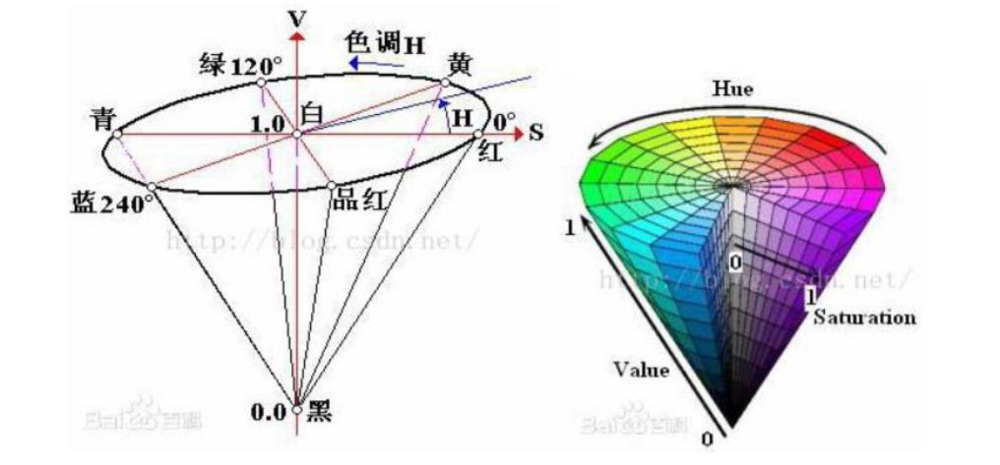

颜色空间转换

```python
cv2.cvtColor(input_image, flag)
```

BGR->Gray: flag 就是 `cv2.COLR_BGR2GRAY`

BGR->HSV: flag 就是 `cv2.COLR_BGR2HSV`


OpenCV 中 HSV 颜色空间的取值范围: H [0, 179] S [0, 255] V [0, 255]


```python
from cv2 import cv2
import numpy as np
#创建图片和颜色块
img=np.ones((240,320,3),dtype=np.uint8)*255
img[100:140,140:180]=[0,0,255]
img[60:100,60:100]=[0,255,255]
img[60:100,220:260]=[255,0,0]
img[140:180,60:100]=[255,0,0]
img[140:180,220:260]=[0,255,255]
#黄红两色的hsv阙值
yellow_lower=np.array([26,43,46])
yellow_upper=np.array([34,255,255])
red_lower=np.array([0,43,46])
red_upper=np.array([10,255,255])
#颜色空间转换 bgr->hsv
hsv=cv2.cvtColor(img,cv2.COLOR_BGR2HSV)
#构建掩膜，并用掩膜进行
mask_yellow=cv2.inRange(hsv,yellow_lower,yellow_upper)
mask_red=cv2.inRange(hsv,red_lower,red_upper)
mask=cv2.bitwise_or(mask_yellow,mask_red)
res=cv2.bitwise_and(img,img,mask=mask)
cv2.imshow('image',img)
cv2.imshow('mask',mask)
cv2.imshow('res',res)
cv2.waitKey(0)
cv2.destroyAllWindows()

```

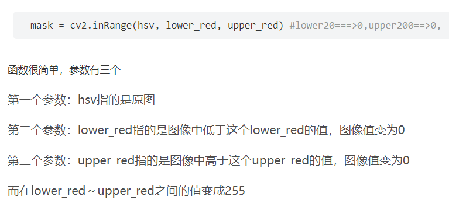


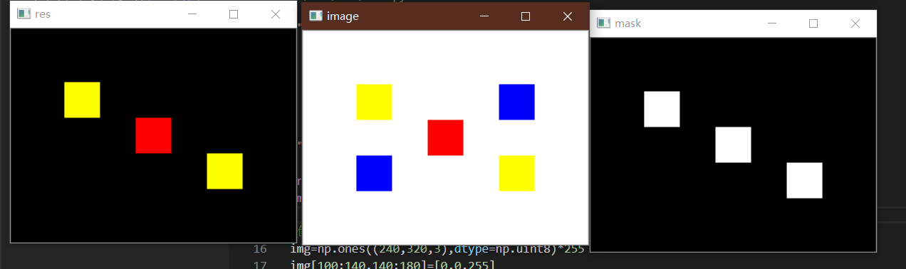

### 颜色检测追踪

步骤：

获取视频流

颜色空间转换 RGB—>HSV 设置 HSV 的阈值

识别并追踪物体

 

常用的方案有两个：

1. 采用颜色直方图，统计 HSV 颜 色空间H值的范围 
2. 在 HSV 颜色空间中，对常见颜色的 HSV 值进行遍历统计轮廓

 

OpenCV 中也存在 2D(二维)直方图，即颜色直方图(H-S，色调-饱和度)，统计该直方图可以更加准确的识别颜色

## 图像变换

傅里叶变换经常被用来分析不同滤波器的频率特性。我们可以使用2D离散傅里叶变换(DFT) 分析图像的频域特性。实现DFT 的一个快速算法被称为快速傅里叶变换（FFT）


##  视频处理

OpenCV提供了`cv.VideoCapture`类和`cv.VideoWriter`类来支持各种类型的视频文件。不同系统中支持的文件类型有所不同，但是==均支持AVI格式的视频文件==。

### 打开视频

* 从摄像头获取视频流：

  ```python
  cap=cv2.VideoCapture(0)
  ```

参数0表示设备的默认摄像头，当设备有多个摄像头时可以改变参数选择

* 读取摄像头的视频流

  ```python
  ret，frame = cap.read()
  ```

  无参数，但需放在死循环中不断读取形成

* 视频释放摄像头资源

  ```python
  cap.release()
  ```

  无参数，程序关闭之前务必关闭摄像头，释放资源。

* 读取视频文件

  ```python
  	cap = cv2.VideoCapture(‘filename’)
  ```

* 捕获帧

  ```python
  	retval,image=cv2.VideoCapture.read()
  ```

  `retval`表示是否捕获成功，True/False

  `image`返回捕获的帧

* ==获取视频属性==

  函数cv2.VideoCapture.get()用于获取cv2.VideoCapture类对象的属性

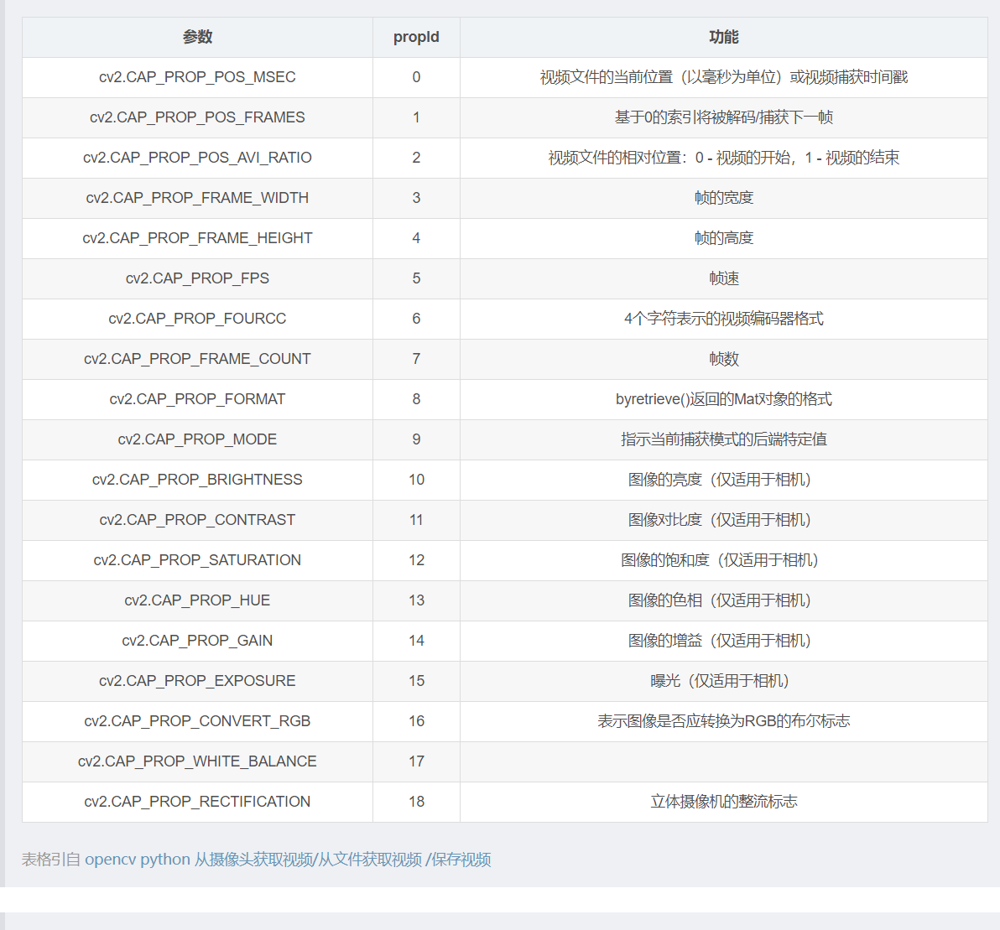

### 保存视频

`cv2.VideoWriter` 类常用的成员函数包括：构造函数、write 函数等

1. 构造函数

OpenCV 为 cv2.VideoWriter 类提供了构造函数，用它来实现初始化工作。该函数的语法格式是：

```python
<VideoWriter object>= cv2.VideoWriter( filename, fourcc, fps, frameSize [,iscolor]）
```

* `filename` 指定输出目标视频的存放路径和文件名。如果指定的文件名已经存在，则会覆盖这个文件。

- `fourcc` 表示视频编/解码类型（格式)。在 OpenCV 中用函数 `cv2.VideoWriter_fourcc()`来指定视频编码格式。`cv2.VideoWriter_fourcc()`有 4 个字符参数。这 4 个字符参数构成了编/解码器的“4 字标记”，每个编/解码器都有一个这样的标记。下面列出几个常用的标记。
  - `cv2.VideoWriter_fourcc('I','4','2','0')`表示未压缩的 YUV 颜色编码格式,色度子采样为4:2:0。该编码格式具有较好的兼容性，但产生的文件较大，文件扩展名为.avi。
  - `cv2.VideoWriter_fourcc('P','I','M','I')`表示 MPEG-1 编码类型，生成的文件的扩展名为.avi
  - `cv2.VideoWriter_fourcc('X','V','I','D')`表示 MPEG-4 编码类型。如果希望得到的视频大小为平均值，可以选用这个参数组合。该组合生成的文件的扩展名为.avi。
  - `cv2.VideoWriter_ fourcc('T','H','E','O')`表示Ogg Vorbis编码类型,文件的扩展名为.ogv
  - `cv2.VideoWriter_ fourcc('F','L','V','I')`表示 Flash 视频，生成的文件的扩展名为.flv

欲知更多的字符参数组合，可以在http://www.fourcc.org/上查询。

若参数 fourcc为“-1”，则程序运行时会弹出一个对话框，在该对话框中，用户可以根据自己的需要选择合适的压缩程序和压缩质量。

- `fps` 为帧速率。
- `frameSize` 为每一帧的长和宽。
- `isColor` 表示是否为彩色图像。

 

2. write 函数

cv2.VideoWriter 类中的函数 cv2.VideoWriter.write()用于写入下一帧视频。该函数的语法格式为：

 ```python
None=cv2.VideoWriter.write(image）
 ```

式中，image 是要写入的视频帧。通常情况下，要求彩色图像的格式为 BGR 模式。

在调用该函数时，直接将要写入的视频帧传入该函数即可。

例如，有一个视频帧为 frame，要将其写入上面的示例中名为 out 的 cv2.VideoWriter 类对象内，则使用语句：

```python
out.write(frame)
```

上述语句会把 frame 传入名为 output.avi的 out 对象内。

## 人脸识别和检测

提取出图像的细节对产生稳定分类结果和跟踪结果很有用。这些提取的结果被称为特征。

专业的表述为：从图像数据中提取特征。虽然任意像素都可能影响多个特征，但特征应该比像素数少得多。两个图像的相似程度可以通过它们对应特征的欧氏距离来度量。

 对给定的图像，特征可能会因区域大小而有所不同，区域大小也可被称为窗口大小(window size)。即使窗口大小不一样，仅在尺度上不同的两幅图像也应该有相似的特征。

==能为不同大小的窗口生成特征非常有用，这些特征集合称为级联。==

Haar级联具有尺度不变性，换句话说，它在尺度变化上具有鲁棒性

OpenCV的Haar级联不具有旋转不变性

## 目标检测和识别

目标检测是一个程序，它用来确定图像的某个区域是否含有要识別的对象。

对象识别是程序识别对象的能力，识别通常只处理已检测到对象的区域